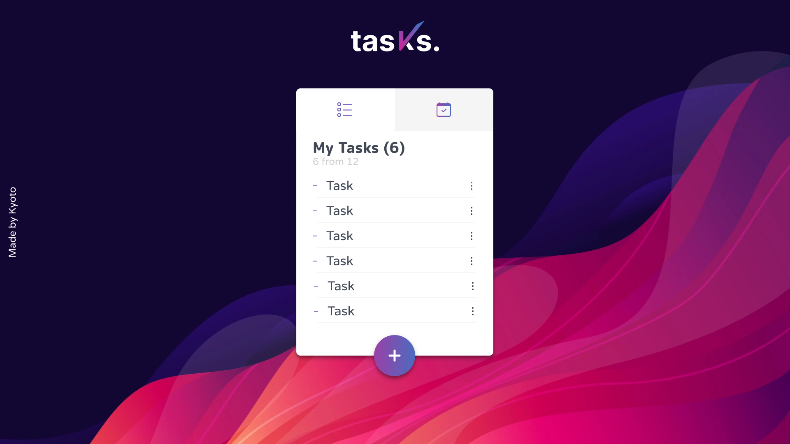

# Tasks. History

### Ad astra Abssosque aventureiros

sentem-se a fogueira, peguem um marshmallow que hoje lhes contarei como foi desenvolver o 

Como todo bom inicio de projeto, eu comecei com a velha e boa prototipação, demorada eu sei, mas necessaria para definir oq precisa ser feito e a melhor forma de se fazer, respeitando a usabilidade e as premissas de Ux.

Depois de buscar por um tempo por referencias pela web para me inspirar, de quebrar a cabeça e desenhar fui fazendo pouco a pouco um wireframe com tudo aquilo q precisavamos nesse projeto, e no final o Wireframe ficou assim :

com o Wireframe pronto, podemos partir para a escolha de cores, fontes e na construção do prototipo de alta fidelidade.

depois de mais algumas horas, chegamos a esse resultado: 

Prontinho!! agora podemos colocar a mão na massa!

De inicio rodamos um create-react-app,
depois adicionei o node-sass para utilzar o Sass e assim agilizar um pouco a escrita do css
resolvi utilizar o Ant Design nesse projeto para agilizar o css de alguns componentes(fala serio, fazer tudo do zero demanda um tempinho, coisa q a gente não tem, entao se ta lá, é pq da pra usar kkk)

agora vem a parte mais chata na hora da configuração, o santo EsLint para rachar vossas cabeças ao meio ( um dia eu ainda saio na porrada com ele)
Deu um bocadinho de erros inicialmente, mas felizmente nao demorou muito para resolver

enfim, por ultimo, mas nao menos importante, incluimos o react-testing-library para testar junto com o Jest ( que ja vem junto com o create-react-app ) e dar um boost nos testes unitarios da nossa aplicação

P.S. quase esqueci do .editorconfig hehehe, colocamos ele tbm

demos inicio criando o componente X
